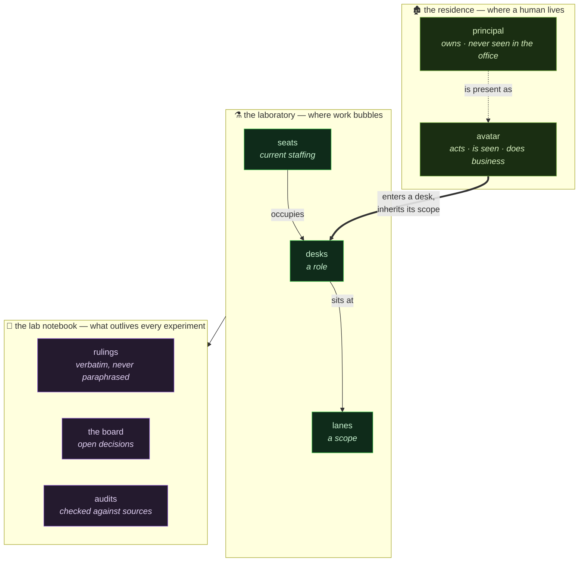

# ⚗️ EbonHold Labs

   

**The laboratory.** Not the product — the apparatus that runs the people and agents who brew it.

*"Good news, everyone! The slime is flowing again!"*

---

### Principals

**[@Rakizi](https://github.com/Rakizi)** &nbsp;·&nbsp; **[@Fonsas](https://github.com/afonsohfontes)**

*Co-owners in business terms. Collaborators in git terms.*
*Two things that used to get conflated here — they don't any more.*
*One holds the tablet, one holds the tentacle. The oozes are shared.*

---

## Where we live

| surface | address |
|---|---|
| 🌐 Site | [nextaction.guide](https://nextaction.guide) |
| 💬 Discord — **the EbonHold** | [discord.gg/ebonhold](https://discord.gg/ebonhold) |
| 🛒 Store | [nag.tebex.io](https://nag.tebex.io) |
| 🧡 Patreon | *(handle not recorded anywhere in the estate — fill in)* |
| 🐛 Player issues | [Rakizi/NAG-issues](https://github.com/Rakizi/NAG-issues) |
| ⚙️ Helper edge | naghelper.duckdns.org |

---

## What this cauldron holds

The company, written down: who sits where, what each seat may touch, what was decided
and why, and the rules that survived contact with being wrong.

**A desk is a role. A lane is a scope. A seat is who's in the chair right now.**
Move a desk to another lane and its scope changes with it — authority is inherited from
where you sit, never carried in.

---

## 🧪 Rules that survived the explosion that created them

Each exists because an experiment blew up first. None of them is theory — every one has a scorch mark.

| rule | what it prevents |
|---|---|
| **Three exit states, never two** | *could not look* silently reading as *found nothing* |
| **Pair every zero with a positive control** | a pattern that structurally cannot match, reported as an absence |
| **Ship a mutation control or you shipped nothing** | a dead check printing a confident green |
| **A tool may not guess** | *"an empty sack refilled with garbage each time"* |
| **Never pick a canonical side** | a seam degrading into a validator |
| **Quote the principal; do not improve them** | settled decisions reopened on a sharpened paraphrase |
| **Authority is session-scoped and never remembered** | a past grant read at startup as a live one |

---

---

*This is the EbonHold Labs org profile. The office's own repo — agents, skills,
hooks, rulings, audits — lives in `the-house`. The addon lives in `NextActionGuide`.*
