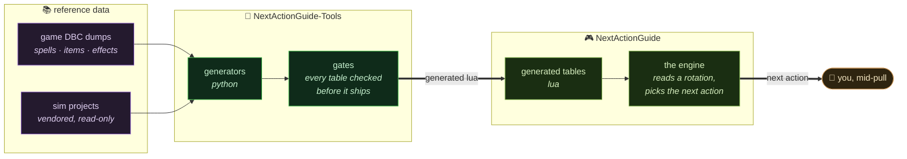

# ⚗️ EbonHold Labs

  

**We make [NextActionGuide](https://nextaction.guide)** — a World of Warcraft addon that
tells you what to press next, on every flavor from Vanilla to Mists.

*"Good news, everyone! The slime is flowing again!"*

**[@Rakizi](https://github.com/Rakizi)** &nbsp;·&nbsp; **[@afonsohfontes](https://github.com/afonsohfontes)** &nbsp;·&nbsp; **[@Smufrik](https://github.com/Smufrik)**

---

## How it actually works

The addon doesn't decide what to recommend. It *reads* what to recommend, from
tables generated out of real game data — so a rotation change is a data change,
not a code change.

⭐ **Everything downstream of a generator is disposable.** If a table is wrong we fix
the generator and regenerate — we don't hand-patch the output. That one rule is why
seven game flavors stay in step instead of drifting apart.

---

## The repos

| repo | what it is |
|---|---|
| **NextActionGuide** | the addon — Lua, ships to players |
| **NextActionGuide-Tools** | the generators, the services, the gates — Python |
| **extern-deps** | a manifest of the sim projects we read from. Vendored, never patched |
| **NAG-pub** | the public-facing slice |

## Where to find us

| | |
|---|---|
| 🌐 Site | [nextaction.guide](https://nextaction.guide) |
| 💬 Discord | [discord.gg/ebonhold](https://discord.gg/ebonhold) |
| 🛒 Store | [nag.tebex.io](https://nag.tebex.io) |
| 🐛 Found a bug? | [Rakizi/NAG-issues](https://github.com/Rakizi/NAG-issues) |

---

<i>Three people, a pile of spell data, and a rule that a check which cannot fail isn't a check.</i>

